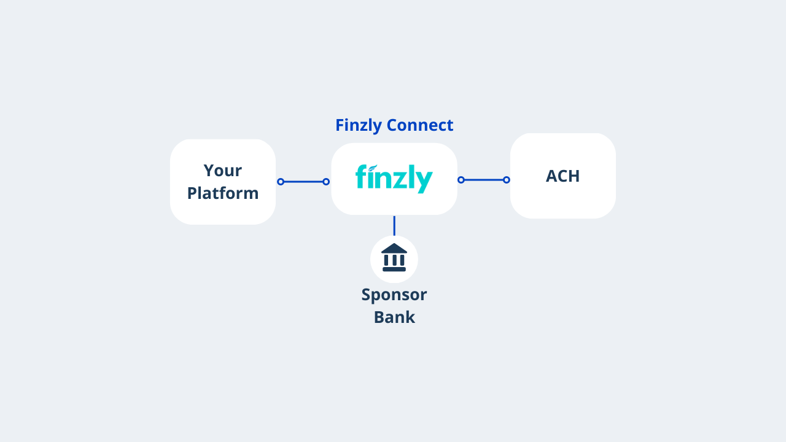

## **ACH** 

### **Overview**

ACH is the most popular, and highly used payment network known for being cost effective for electronic payments. Typically, they take 1-2 days to settle. ACH payments are exchanged in NACHA-formatted files. NACHA sets the rules and guidelines for the processing of ACH payments. ACH APIs are becoming popular due to their ability to integrate into a variety of systems for automation of manually intensive payments. Finzly Connect APIs give access to the ACH network.

<!-- ## **ACH Payment** -->

### **Key features of Finzly Connect ACH APIs:**

- Complete payment automation to initiate ACH credit and debit
- Round-the-clock initiation with the ability to be processed during the next ACH processing window
- Automatic reconciliation and error handling
- Same Day ACH to expedite payments that need to be settled urgently
- Payments supported for several SEC codes
- Ability to process both single and batch ACH payments 
- Retrieve payment status through API 
- NACHA standardized practices

### **Sample use case:**

A payroll platform wants to create an embedded payment workflow in their payroll processing platform. Finzly Connect APIs can help them process their batch payroll, automating their workflow, increasing operational efficiency, offering better customer experience.
1. Set up customers on virtual accounts using Finzly Connect API
2. Embed ACH API to process payroll batch payment
3. Obtain status of each ACH payment processed
4. Track the status change for all payments including returns
5. Update payment status for customers in payroll processing platform for each status change

<!-- ### **SEC Codes**

Each payment entry must be categorized under one of the several Service Entry Class Codes, aka SEC Codes. Finzly supports all the SEC Codes listed below.

Note: Finzly payment hub supports all above sec codes from RDFI perspective. The ODFI perspective the following sec codes are supported from ODFI perspective - BOC, CCD, CIE, CTX, IAT, POP, POS, PPD, TEL and WEB. -->

<!-- **ACH Terminologies** 

While ACH payments are cheaper compared to other payment networks, they have most the complexity than other payment rails, as ACH has evolved over several decades to support various use cases of the industry.

**Files & Batches**

Each payment is created as a payment entry, and the entries are grouped in batches and the batches are grouped in a file. Each file and batch may be balanced or unbalanced. 

**Balanced & Unbalanced Files**

In a balanced file, the outbound debits and credits are offset with a customer’s DDA account entry. In an unbalanced file, the bank would offset it with the customer’s default account.  -->